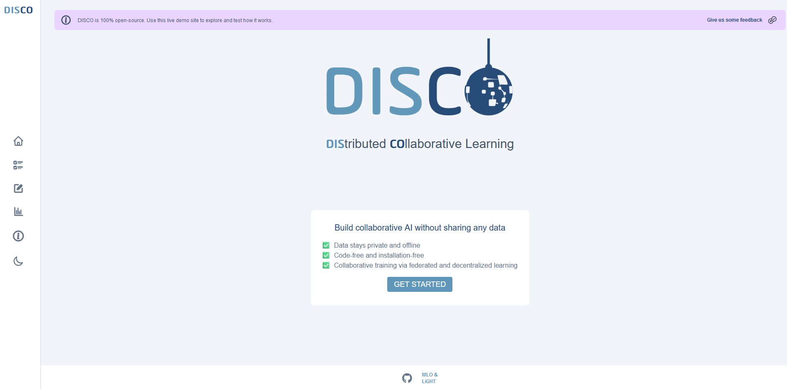
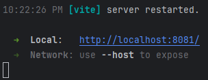
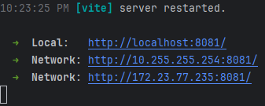

# DISCO custom examples

This folder contains examples of how to use DISCO via Node.js scripts.

Running Disco on Windows might pose some challenges. If you run on Windows, it is recommended to use **WSL2**.

## Development setup

Note: This is an abridged version of the documentation in [DEV.md](../DEV.md#installation-guide).


The following instructions will install the required dependencies, build Disco.js and launch a DISCO server and a web client. If you run into any sort of trouble check our [FAQ](./docs/FAQ.md); otherwise please create a new issue.

**1.** Clone the repository

```
git clone git@github.com:epfml/disco.git
cd disco
```

**2.** Install Node.js

We recommend using [nvm](https://github.com/nvm-sh/nvm) (Node Version Manager) to handle multiple Node.js versions. Start by installing `nvm` by following [their installation instructions](https://github.com/nvm-sh/nvm).
After installation, you should be able to run

```
nvm -v
0.39.7 # at the time of writing
```

Use it to install the version we use in DISCO.

```
nvm install # it reads `.nvmrc` to select the correct version
```

`nvm` manages your different Node.js versions while `npm` handles your different Node.js project packages within one version.

**3.** Install the dependencies

```
npm ci
```

**4.** Build the projects

Then we need to build the packages, which means to compile TypeScript into JavaScript.

Disco is split in multiple packages, called workspaces in NPM, which are described in the [Structure Section](#structure).
You can add `--workspaces` (or shorter as `-ws`) to many `npm` commands to act on all packages.
Or you can select a specific workspace via `--workspace=$name-or-path-to-package` (`-w $name-or-path-to-package`).

```
npm -ws run build
```

**5.** Download and extract the sample training datasets. These datasets are used in the automated tests.

```
./datasets/populate
```

## Setup on Windows

Disco is cool, but kinda weird.
To run it, you need a server. The server package is, however, not available as a package on NPM.
Instead, you need to clone the repo, then start the server from there.
First, follow installation guide in DEV.md.
Then, execute the examples provided in docs/examples (or look at our custom examples).

You need to start two servers:
* Disco Server (runs typically on port 8080)

  Web page looks like this: \
   \
  It can be run by executing the following command in the directory `./new-example`.
  ````bash
  npm run train
  ````
  
* Disco WebApp Server (runs typically on port 8081)

  Web page looks like this: \
   \
  It can be run by executing the following command in the root directory of this repo.
  ````bash
  npm -w webapp start
  ````

There is some extra effort involved to make the system runnable from external devices, like mobile phones.

1. Make sure your clients and your server are in the same network (i.e. the clients need to be able to reach the IP address of the server)
2. Add inbound firewall rules (Windows)

   For a guide, see `./docs/Windows_Firewall_Config.md`.
3. Make the Web App Server externally reachable

   The Web App Server typically runs on localhost. \
    \
   To make the server reachable from outside the machine, it has to be hosted on IP address `0.0.0.0`.
   
   The web app uses [vite](https://vite.dev/), so we need to configure the host inside the vite config.
   In the `../webapp/vite.config.ts` file, set the host to `0.0.0.0`.
   ````typescript
   // ...
   export default defineConfig({
     server: {
       host: "0.0.0.0",
       port: 8081
     },
     // ...
   });
    ````
   After that, start the web frontend server. If it is already running, it will restart on its own. \
    \
   We can now see it is available on the network.
   Your IP address will most likely vary from mine.
   In the following, I will continue to use the third IP Address (`172.23.77.235`).
   However, this IP address only exists within WSL, so we have to route traffic from Windows to it (step 5).
4. Server host config
   The web app needs to know on which host (protocol + IP address + port) the server is running.
   This is defined as the environment variable called `VITE_SERVER_URL`. 
   It is defined in three `.env` files, depending on the currently selected environment.

   The files are called:
   * `.env.development`
   * `.env.production`
   * `.env.test`
   
   Just update the host in every file, and you are good.
   Example:
   ````ènv
   VITE_SERVER_URL=http://172.16.254.162:8080
   ````
5. WSL Bridge
   Since the servers run in the WSL, they might not be reachable from the outside network.
   To fix this, run the following commands in the Windows PowerShell with administrator rights.
   ````powershell
   netsh interface portproxy add v4tov4 listenaddress=0.0.0.0 listenport=8081 connectaddress=172.23.77.235 connectport=8081
   netsh interface portproxy add v4tov4 listenaddress=0.0.0.0 listenport=8080 connectaddress=172.23.77.235 connectport=8080
   ````
   This makes sure that the network traffic is routed from the Windows machine to the WSL.
6. Test
   Now, your servers should be reachable through the IP address of your Windows machine.
   To see your IP address, use the `ipconfig` command in the Windows PowerShell.
   Type into your browser:
   * client: `http://<your-ip>:8081/`
   * server: `http://<your-ip>:8080/`

## Original docs

### Using `discojs-node` for federated training

`training.ts` imports `discojs-node` (rather than the alternative `discojs-web`) to create two clients jointly training on the Titanic dataset in a federated manner. The example is self-contained and illustrates key uses of `discojs-node`:

- How to train a federated model on pre-defined tasks
- How to create multiple clients
- How to start a server instance from a script
- How to load and preprocess local data

You can run the training example as follows:

```
cd docs/example
npm run train # compiles TypeScript and runs training.ts
```

As you can see in `training.ts` a client is represented by a `Disco` object:

```js
const disco = new Disco(task, { url, scheme: "federated" });
for await (const round of disco.fit(dataset))
  for await (const epoch of round)
    for await (const batch of epoch);
await disco.close();
```

To simulate more or less users change the number of calls to `runUser`:

```js
// The Promise creates two clients and waits for their training to complete
await Promise.all([runUser(url), runUser(url)]);
```

### Adding a new custom task

The server handles the pre-defined machine learning tasks and sends them to users when queried. `custom_task.ts` illustrates how to add a custom task to the server such that it can be queried by users. More details on custom tasks can be found in [TASK.md](../TASK.md).

You can run the custom task example with:

```
cd docs/examples
npm run custom_task # compiles TypeScript and runs custom_task.ts
```

### Creating a CSV file to connect a dataset in DISCO

DISCO allows connecting data through a CSV file that maps filenames to labels. The python notebook `dataset_csv_creation.ipynb` shows how to create such a CSV and the `scin_dataset.ipynb` shows how to download the [SCIN dataset](https://github.com/google-research-datasets/scin/tree/main?tab=readme-ov-file) and how to preprocess it in a format accepted by DISCO.
