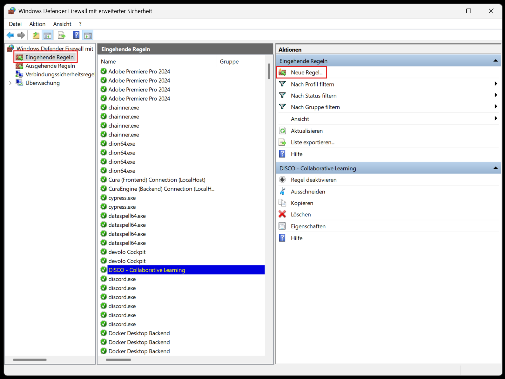
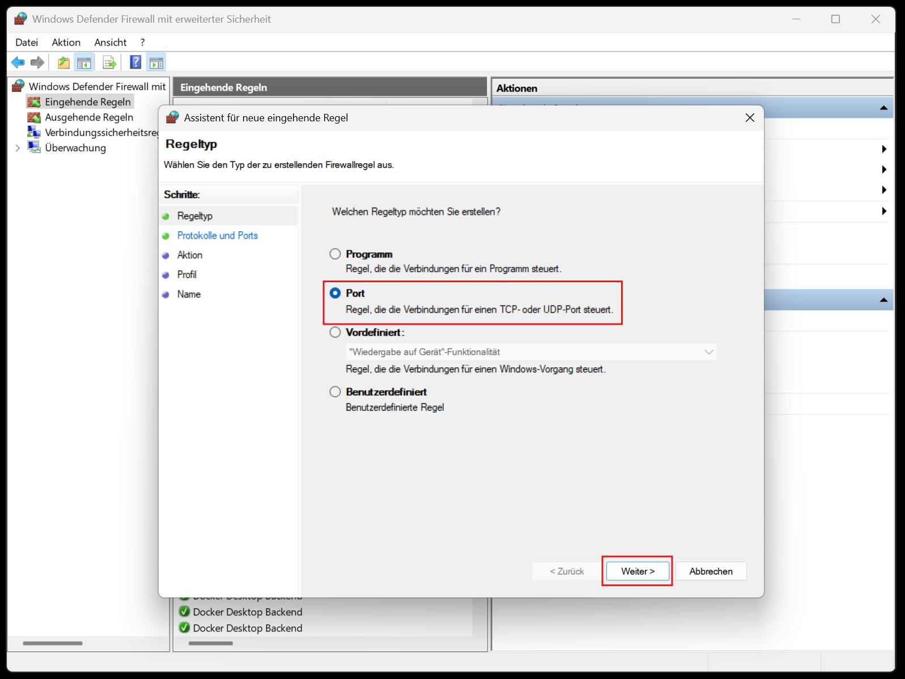
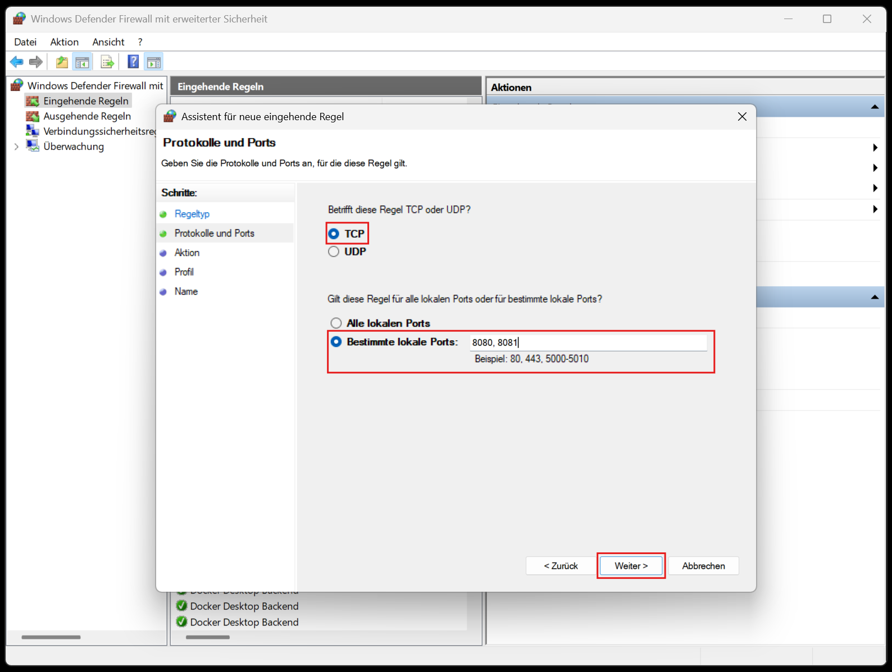
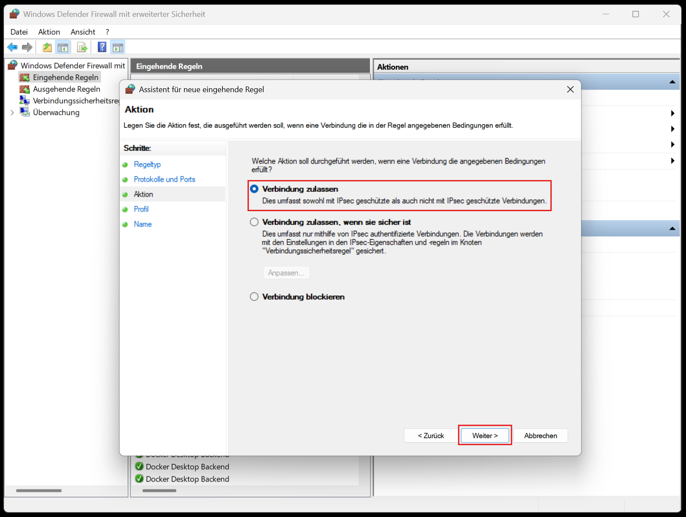
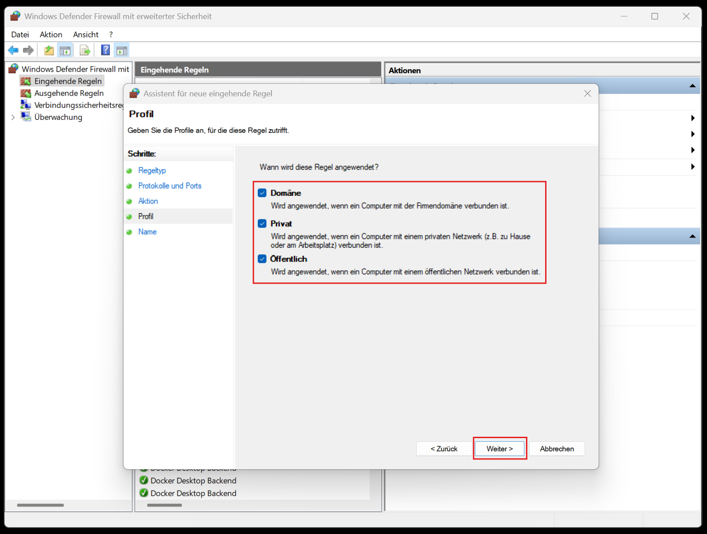
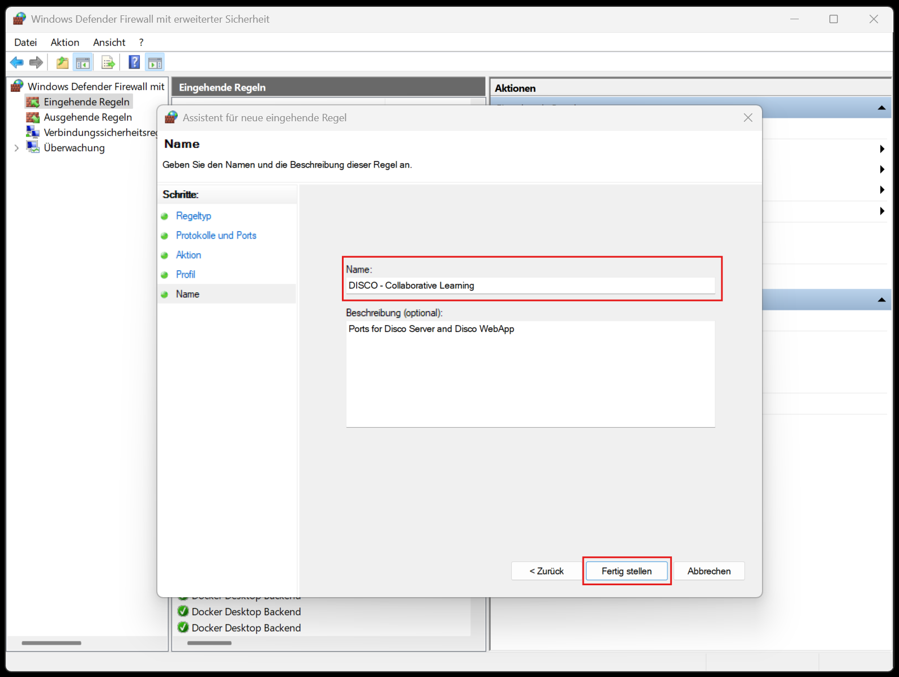

# Windows Firewall Config for Disco Server and WebApp Server
Add an inbound firewall rule that allows incoming traffic on the ports for the disco server (i.e. 8080) and web app server (i.e. 8081).

The screenshots are in German, but should still be useful for people who do not speak the language.

